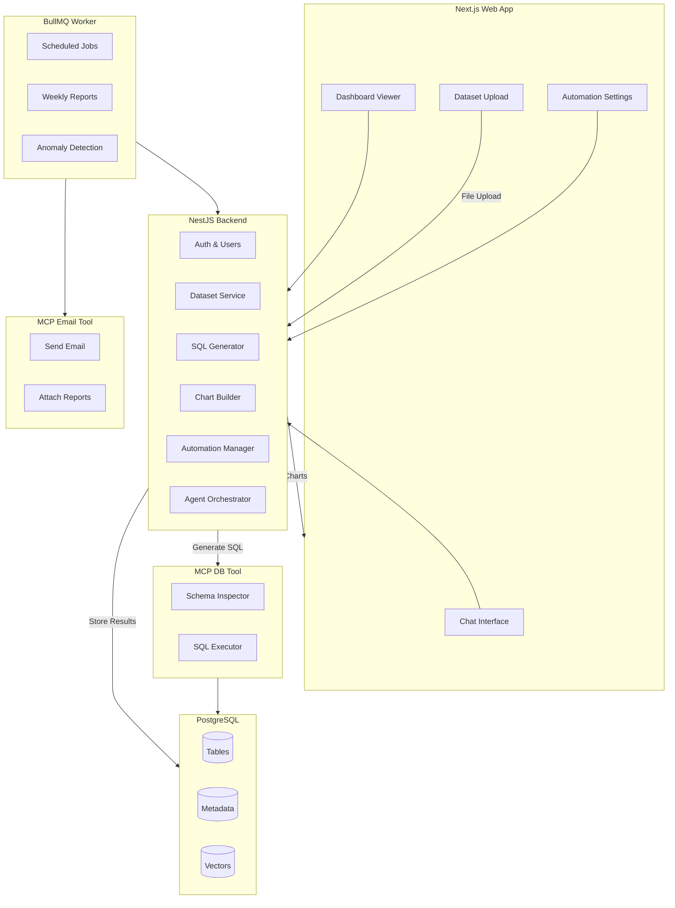

# System Architecture

This document explains the architecture of the AI Data Analyst platform, including its design goals, component-level breakdown, data flow, and internal services.

---

## 🎯 Goals

- Convert natural language into SQL queries  
- Generate charts & dashboards automatically  
- Support scheduled insights (daily/weekly/monthly)  
- Provide agents with safe access to the database and email systems via MCP tools  
- Maintain a clean, modular architecture suitable for scaling  
- Support multi-tenant users and datasets  
- Keep the project buildable as an MVP without enterprise overengineering

---

# 🏗️ High-Level Architecture



## 🧩 Component Breakdown

Below is a detailed explanation of each major component in the system.

---

### **UI (Next.js)**

The user interface provides:

- Chat-style query interface  
- Dataset upload & preview  
- Dashboard viewer  
- Automation settings  
- Authentication and basic routing  

**Why Next.js?**

- Modern React framework  
- Built-in API routes when needed  
- Excellent for dashboards  
- Supports server actions (optional)

---

### **Backend API (NestJS)**

Central business logic layer, responsible for:

- Authentication & user management  
- Dataset ingestion (CSV parsing, validation)  
- Metadata extraction  
- SQL generation pipeline (via AI agents)  
- Chart configuration builder  
- Stored dashboard management  
- Automation scheduling endpoints  
- System audit logs  

The backend communicates with MCP tools instead of executing raw SQL or emailing directly.

---

### **Agent Orchestrator**

A lightweight orchestrator inside the backend that:

- Receives natural language queries  
- Generates SQL using OpenAI models  
- Retrieves schema using MCP DB tool  
- Validates SQL using schema context  
- Executes SQL through MCP  
- Generates JSON chart configuration  
- Summarizes insights for UI  

This keeps the system modular and secure.

---

### **Workers (BullMQ)**

Long-running background jobs that handle:

- Scheduled daily/weekly/monthly reports  
- Automated KPI insights  
- Anomaly detection  
- Batch processing tasks  

Workers interact with:

- Backend API  
- MCP DB Tool  
- MCP Email Tool  

Workers never generate SQL directly — they use the same agent pipeline for consistency.

---

### **MCP Database Tool**

Provides:

- Schema inspection  
- Safe SQL execution  
- Controlled read-only access  
- Enforced row limits  
- Validation and filtering  

This isolates database credentials and adds a security boundary between the agent and DB.

---

### **MCP Email Tool**

Responsibilities:

- Sending email reports  
- Attaching files (charts, summaries, PDFs)  
- Handling text or HTML messages  

Triggered primarily by worker jobs.

---

### **Database (PostgreSQL)**

Stores:

- User accounts, sessions  
- Datasets  
- Tables generated from CSV uploads  
- Dashboard records  
- Generated insights  
- Query history  
- Embeddings (pgvector)

---

### **Data Flow Summary**

### Data Flow Summary

**User Query Flow**

```text
User -> UI -> Backend -> Agent -> MCP DB Tool -> Database -> Backend -> UI
```

**Scheduled Report Flow**

```text
Cron -> Worker -> Agent -> MCP DB Tool -> Database -> MCP Email Tool -> User
```

### Scalability Notes

- APIs are stateless → scale horizontally  
- Workers can scale independently  
- MCP tools isolate DB/email credentials  
- pgvector enables scalable embeddings  
- Add read replicas for Postgres under high load


